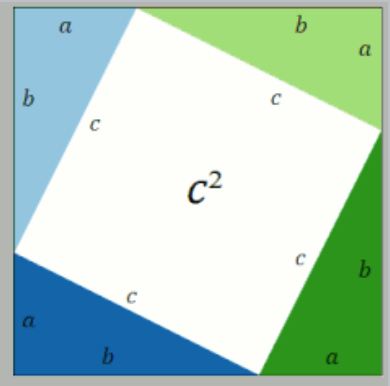

# Direct Proofs
### Caleb O'Neal - 2024-2-13
---

A direct proof uses a series of mathematical statements to deduce a result, thus proving the result.\

Take the Pythagorean Theorem

Given this the total area is $(a + b)^2$.

The four triangles and the area of the square in the center must have an area equal to this, so:
$$(a + b)^2 = c^2 + 4\frac{ab}{2}$$
This can be simpliied to
$$(a+b)^2=c^2 + 2ab$$
If you expand the left side you get
$$a^2+2ab+b^2=c^2+2ab$$
The $2ab$ terms cancel out leaving us with
$$a^2+b^2=c^2$$

